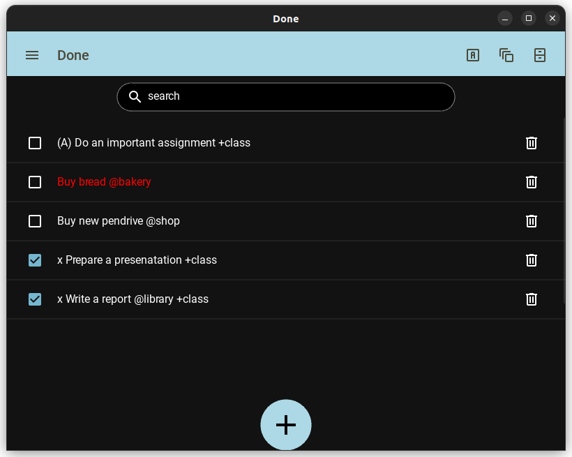
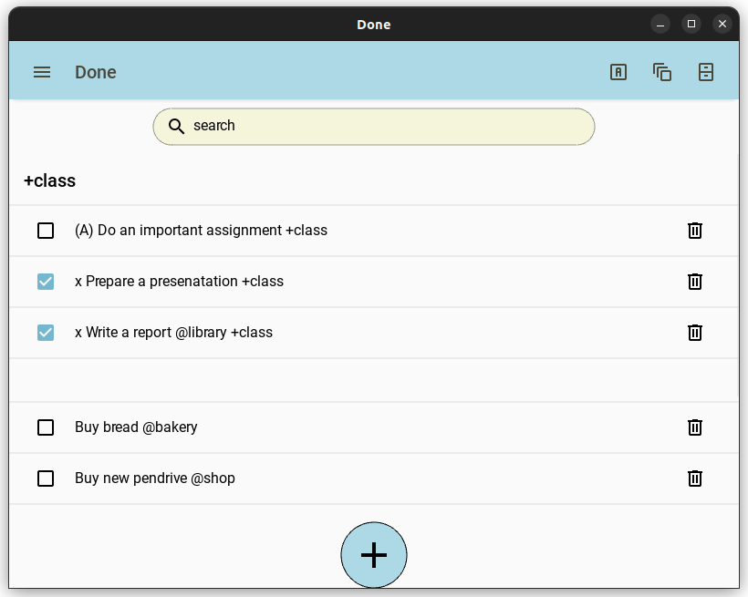

# Done
Minimalistic desktop application for managing tasks and projects in [todo.txt](http://todotxt.org/todo.txt) format

## Description
Application provides simplistic yet pretty graphical user interface for easier managment of tasks in provided text file formatted by the rules of the todo.txt.
Goal of this project is to provide the unnecessary functionality and smooth usage with addition of good looking themes.
Motivation was not being able to find a compromise between looks, functionality and keyboard-driven approach in other existing apps.

Application is written in Python with kivy and kivyMD library.

As of right now app, while providing full basic functionality, is not fully yet developed and there are possible features to add.

## Installation
To run the app you must have [Python](https://www.python.org/) installed on your computer. It is assumed that [git](https://git-scm.com/) is installed and working.

### Windows

#### Go to desired installation place
~~~
cd %userprofile%\Desktop
~~~
#### Clone the project
~~~
git clone https://github.com/MarcinKadziolka/Done
~~~
#### Enter created directory
~~~
cd Done
~~~
#### Create new virtual environment
##### - Using venv
~~~
python -m venv done_venv
~~~
##### - Using virtualenv
~~~
virtualenv done_venv
~~~
#### Activate the environment
~~~
done_venv\Scripts\activate
~~~
After activating environment you should see name of your virtual environment preceeding command line, for example:
~~~
(done_venv) computer@ubuntu:~/Desktop/Done$
~~~
#### Install all dependencies from requirements.txt file
~~~
pip install -r requirements.txt
~~~
#### Run the app
Note that on first use you must have text file created on your machine in order to use the app.
~~~
python done.py
~~~
#### After finishing using the app, deactivate the environment
~~~
deactivate
~~~
### Linux
#### Go to desired installation place
In this example desktop will be used
~~~
cd ~/Desktop
~~~

#### Clone the project
~~~
git clone https://github.com/MarcinKadziolka/Done
~~~
#### Enter created directory
~~~
cd Done
~~~
#### Create new virtual environment
##### - Using venv
~~~
python3 -m venv done_venv
~~~
##### - Using virtualenv
~~~
virtualenv done_venv
~~~
#### Activate the environment
~~~
source done_venv/bin/activate
~~~
After activating environment you should see name of your virtual environment preceeding command line, for example:
~~~
(done_venv) computer@ubuntu:~/Desktop/Done$
~~~
#### Install all dependencies from requirements.txt file
~~~
pip install -r requirements.txt
~~~
#### Run the app
~~~
python3 done.py
~~~
#### After finishing using the app, deactivate the environment
~~~
deactivate
~~~

## Usage

